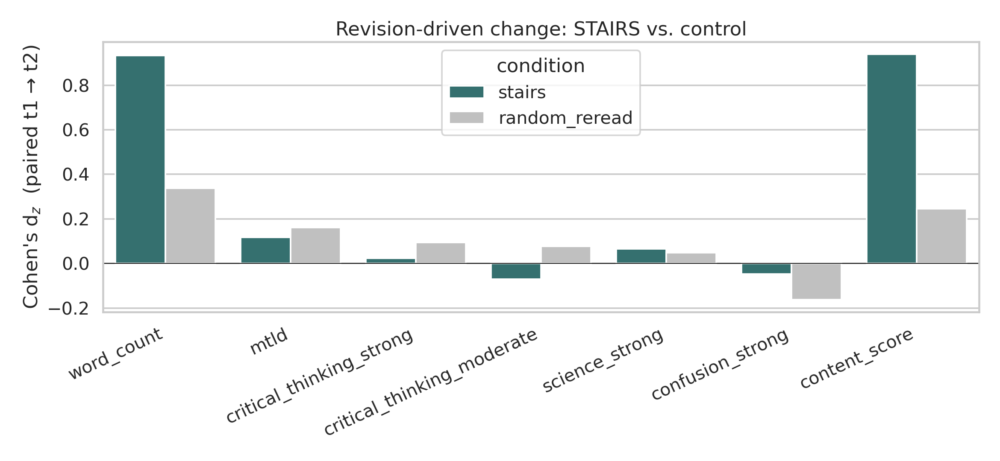
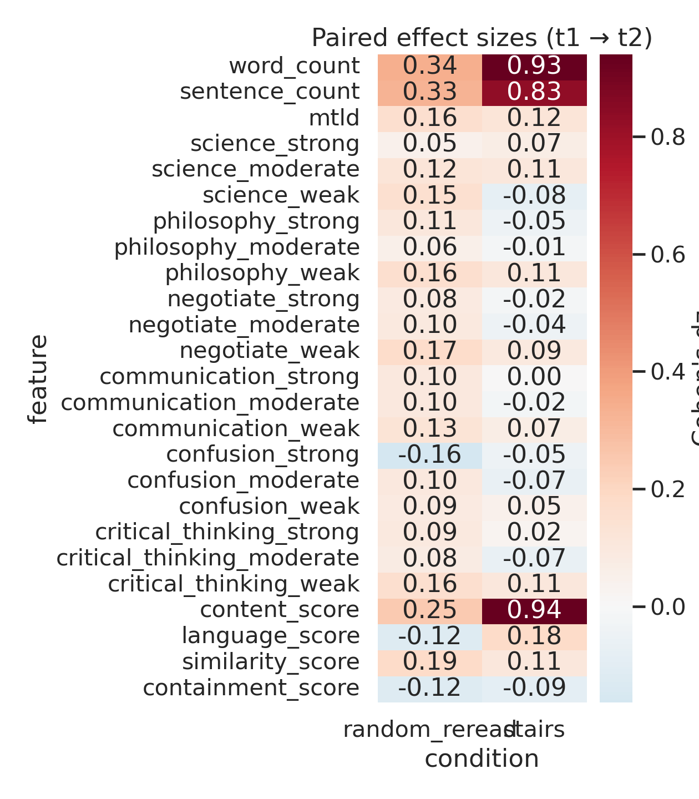

# STAIRS Feedback and Summary Revision: Methods and Results

## Methods

We analyzed summary revision behavior from a Prolific study (N = 372) comparing two conditions: STAIRS (interactive, dialogic feedback) and random reread (control). Our unit of analysis was the paired revision: a student's first and second summary submission on the same textbook page. This yielded 157 STAIRS revision pairs and 110 control pairs. For each summary, we computed surface-level features (word count, sentence count, MTLD lexical diversity) and semantic similarity features using spaCy's `en_core_web_lg` word vectors. For the semantic features, we extracted seed word lists from Empath's pre-built lexical categories (science, philosophy, negotiate, communication, confusion) and defined a custom critical-thinking category seeded with Bloom's taxonomy verbs (analyze, compare, contrast, evaluate, infer, explain, justify, interpret, consider, assume, conclude). We computed the centroid vector for each category's seed list, then scored every content token in each summary by cosine similarity to each centroid, binning tokens into three tiers: strong (>= 0.50), moderate (0.35--0.50), and weak (0.20--0.35), reported as counts per 100 words. We also carried forward iTELL's existing content, language, similarity, and containment scores. For each feature, we computed paired effect sizes (Cohen's d_z) within each condition, and fit mixed-effects models of the form `feature ~ t * condition + (1 | user_id)` to test the t-by-condition interaction.

## Results

STAIRS feedback drove large, reliable changes in summary structure from first to second submission. Word count increased by a mean of 23.9 words in the STAIRS condition (d_z = 0.93, p < .001) compared to 5.6 words in the control (d_z = 0.34, p = .001), and the t-by-condition interaction was significant (z = 5.39, p < .001). Sentence count showed a parallel pattern (STAIRS d_z = 0.83 vs. control d_z = 0.33; interaction z = 4.17, p < .001). iTELL's content score---an automated measure of how well the summary captures source material---showed the strongest differential, with STAIRS revisions gaining 0.28 points (d_z = 0.94, p < .001) versus 0.03 in the control (d_z = 0.25; interaction z = 4.35, p < .001). MTLD lexical diversity showed small, non-significant gains in both conditions (STAIRS d_z = 0.12; control d_z = 0.16), suggesting that the additional content in STAIRS revisions did not come at the cost of lexical sophistication.

The vector-similarity category features---including the critical-thinking category---showed uniformly small and non-significant effects in both conditions (all |d_z| < 0.18). The effect-size heatmap below displays the full feature set. None of the t-by-condition interactions for the semantic categories reached significance. This null result likely reflects a ceiling on what lexical-similarity measures can detect in short student summaries: the summaries are brief (median ~50 words at t1), factual in register, and constrained to a single textbook page, leaving little room for variation in the proportion of tokens semantically close to abstract category centroids. The clear story from these data is structural: STAIRS feedback prompts students to write substantially more, add more sentences, and better cover the source content, while the control condition produces only minor edits. Whether these structural changes reflect deeper cognitive engagement---or simply more thorough reporting---remains an open question that may require qualitative analysis of the feedback-revision triples to address.

